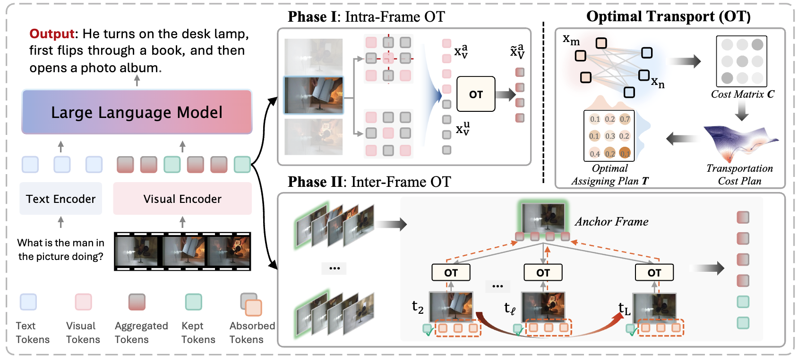

<div align="center">
	<h1>AOT: Token Reduction via Local and Global Contexts Optimization for Efficient Video Large Language Models</h1>
	<a href="https://arxiv.org/abs/2603.01400"></a>
	<a href="https://tyroneli.github.io/AOT"></a>
</div>


	



## Quick Start

### 1. Create the environment

### 2. Download or place checkpoints

### 3. Perform the Token Reduction Evaluation

## Citation
If you use AOT in academic or industrial research, please cite:

```bibtex
@article{li2026token,
  title={Token Reduction via Local and Global Contexts Optimization for Efficient Video Large Language Models},
  author={Li, Jinlong and Jiang, Liyuan and Zhang, Haonan and Sebe, Nicu},
  journal={arXiv preprint arXiv:2603.01400},
  year={2026}
}
```

## Related Project


## License
- **Code**: MIT License (see `LICENSE`).
- **Model weights**: Adobe Research License (see `LICENSE-WEIGHTS`).  The model weights are **not** covered by the MIT License.

## Acknowledgements
- 
- 
